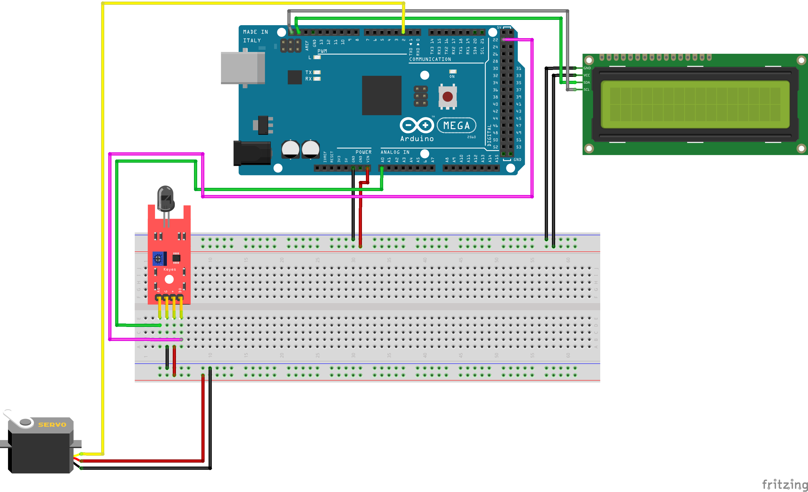

# 🛠️ Mock Up Board Simulator

<p align="center">
	
</p>

<p align="center">
	<b>Arduino & Raspberry Pi Board Simulator</b><br>
	<i>Simulate, test, and prototype embedded systems with real-world components in software and hardware.</i>
</p>


---

## ✨ Features

- 16x2 I2C LCD display simulation
- Flame sensor (analog & digital) simulation
- Servo motor control
- Joystick input (X, Y, Switch)
- Modular code for both Arduino and Raspberry Pi
- Serial/command-line interface for testing components
- Easy pin mapping and configuration
- **Planned:**
	- Infrared Receiver
	- RFID System
	- Password Lock
	- Sound Sensor
	- Dot Matrix Display
	- Ultrasonic Sensor

---

## 🛠️ Components Used

| Component           | Description                |
|---------------------|----------------------------|
| 16x2 I2C LCD        | Display output             |
| Flame Sensor        | Fire/flame detection       |
| Servo Motor         | Rotational actuator        |
| Joystick            | Analog + digital input     |
| **Planned:**        |                            |
| Infrared Receiver   | Remote control input       |
| RFID System         | Tag/card authentication    |
| Password Lock       | Keypad/password input      |
| Sound Sensor        | Audio detection            |
| Dot Matrix Display  | LED matrix output          |
| Ultrasonic Sensor   | Distance measurement       |

---

## ⚡ Hardware & Software Requirements

- **Hardware:**
	- Arduino Uno/Nano (or compatible)
	- Raspberry Pi (any model with Python 3)
	- Breadboard, jumper wires
	- 16x2 I2C LCD, Flame Sensor, Servo Motor, Joystick
	- (Optional: Infrared, RFID, Sound, Matrix, Ultrasonic modules)
- **Software:**
	- Arduino IDE (for Arduino code)
	- Python 3.x (for Raspberry Pi simulation)
	- [Fritzing](https://fritzing.org/) (for .fzz wiring diagrams)
	- Required Arduino libraries: `LiquidCrystal_I2C`, `Servo`
	- Required Python packages: None (uses standard library)

---

## 🚀 Getting Started

### Arduino
1. Open `source/arduino/BoardSimulator/BoardSimulator.ino` in Arduino IDE.
2. Install required libraries: `LiquidCrystal_I2C`, `Servo` (via Library Manager).
3. Connect components as per the wiring diagram below.
4. Upload the sketch to your Arduino board.
5. Open Serial Monitor (9600 baud) to interact with the simulator.

### Raspberry Pi (Python)
1. Navigate to `source/rpi/BoardSimulator/`.
2. Run `python main.py` (Python 3 required).
3. Type commands in the terminal to test components (e.g., `LCD`, `FLAME`, `SERVO:90`, `JOYSTICK`).

<!-- TODO: Update installation steps once all modules are added -->

---

## 🔧 Wiring / Circuit Details

Wiring is defined in `Pins.h` (Arduino) and `pins.py` (Raspberry Pi). See the Fritzing diagram below for physical connections.

<p align="center">
	
</p>

<!-- TODO: Add detailed wiring table and pinout here -->

---

## 🖥️ Code Structure

```
source/
	arduino/BoardSimulator/
		BoardSimulator.ino         # Main Arduino sketch
		I2CLcd.h/.cpp              # LCD display driver
		FlameSensor.h/.cpp         # Flame sensor driver
		ServoMotor.h/.cpp          # Servo motor driver
		JoystickController.h/.cpp  # Joystick driver
		Pins.h                     # Pin assignments
	rpi/BoardSimulator/
		main.py                    # Main Python entry point
		i2c_lcd.py                 # LCD simulation
		flame_sensor.py            # Flame sensor simulation
		servo_motor.py             # Servo simulation
		joystick_controller.py     # Joystick simulation
		pins.py                    # Pin assignments
diagram/
	Wiring.fzz                   # Fritzing wiring diagram
	Wiring.png                   # Wiring image
```

---

## 📷 Screenshots / Demo

<p align="center">
	<!-- TODO: Add real screenshots or demo GIFs here -->
	
</p>

---

## 🔮 Future Improvements

- Add support for all planned hardware modules
- Implement advanced simulation features (timing, error injection)
- Add GUI for easier interaction
- Expand documentation and add more wiring diagrams
- Add unit tests and CI integration

---

## 🤝 Contributing

Contributions are welcome! Please open issues or pull requests for bug fixes, new features, or documentation improvements.

---

## 📜 License


---

## 📬 Contact

- **Email:** [quezon.province.pd@gmail.com](mailto:quezon.province.pd@gmail.com)
- **GitHub:** [qppd](https://github.com/qppd)
- **Portfolio:** [sajed-mendoza.onrender.com](https://sajed-mendoza.onrender.com)
- **Facebook:** [facebook.com/qppd.dev](https://facebook.com/qppd.dev)
- **Facebook Page:** [facebook.com/QUEZONPROVINCEDEVS](https://facebook.com/QUEZONPROVINCEDEVS)

<p align="center">
	<a href="mailto:quezon.province.pd@gmail.com"></a>
	<a href="https://github.com/qppd"></a>
	<a href="https://sajed-mendoza.onrender.com"></a>
	<a href="https://facebook.com/qppd.dev"></a>
	<a href="https://facebook.com/QUEZONPROVINCEDEVS"></a>
</p>

---
